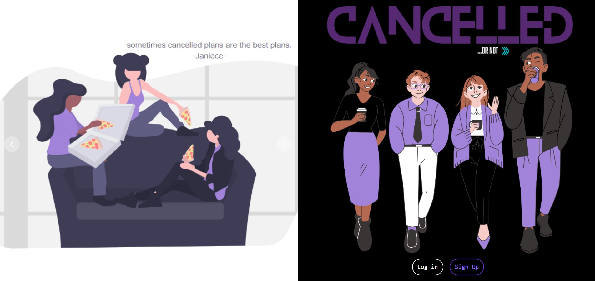

# cancelled-event-REACT

## Description

Canceling plans has always been a source of anxiety, even when both sides don’t want to go. Our application is made with cancelling in mind. 

We wanted a way to Cancel plans with a group, or even with one friend, that isn’t weird or hard. We also wanted an easier way to make plans more detailed so people know not just where to go and when, but things like what to wear and how much money the group is planning to spend.

This project is a collaborative MERN full-stack application. The Cancelled application provides a simple way to create and plan events and invites, and shamelessly cancel if things change.

Let’s say you made plans to go out with a friend, but the day of you’re in bed and realize you just want to stay there. You can hit cancel on your plans without the other person ever knowing you want to cancel. BUT if they also hit cancel, the plans are then officially cancelled and both friends are notified.

## Table of Contents

- [Installation](#installation)
- [Usage](#usage)
- [Tests](#tests)
- [Contributing](#contributing)
- [Credits](#credits)
- [License](#license)

## Installation

You can install Node.js and clone this repository to your local machine. To run on the localhost `npm install`, and `npm run develop`. The application can also be used on the browser or downloaded to your local machine to use as a PWA from browser.

## Usage

Create a profile on the Sign Up page to start adding friends and creating events. Once logged in you can create events, add friends, or cancel plans. You can view a demo here <https://watch.screencastify.com/v/LcRht9Tip9a2yeuFWeSN>

### Deployed Webpage

## Tests

N/A

## Contributing

If you would like to contribute to this application, please reach out to any of us via email or GitHub! Feel free to create a PR/Issue for any suggestions/improvements.

## Credits

[Catherine Sinkowski](https://github.com/CatSink)  
[Sofie Milillo](https://github.com/smilillo)  
[Jaime Marsh](https://github.com/jaimemarsh)  
[Stephanie Simmons](https://github.com/ssimmons122)  
[Janiece Lewis](https://github.com/Janiece-Lewis)  

## License

MIT License

Copyright (c) [2023] [Catherine-Sinkowski]

Permission is hereby granted, free of charge, to any person obtaining a copy
of this software and associated documentation files (the "Software"), to deal
in the Software without restriction, including without limitation the rights
to use, copy, modify, merge, publish, distribute, sublicense, and/or sell
copies of the Software, and to permit persons to whom the Software is
furnished to do so, subject to the following conditions:

The above copyright notice and this permission notice shall be included in all
copies or substantial portions of the Software.

THE SOFTWARE IS PROVIDED "AS IS", WITHOUT WARRANTY OF ANY KIND, EXPRESS OR
IMPLIED, INCLUDING BUT NOT LIMITED TO THE WARRANTIES OF MERCHANTABILITY,
FITNESS FOR A PARTICULAR PURPOSE AND NONINFRINGEMENT. IN NO EVENT SHALL THE
AUTHORS OR COPYRIGHT HOLDERS BE LIABLE FOR ANY CLAIM, DAMAGES OR OTHER
LIABILITY, WHETHER IN AN ACTION OF CONTRACT, TORT OR OTHERWISE, ARISING FROM,
OUT OF OR IN CONNECTION WITH THE SOFTWARE OR THE USE OR OTHER DEALINGS IN THE
SOFTWARE.
